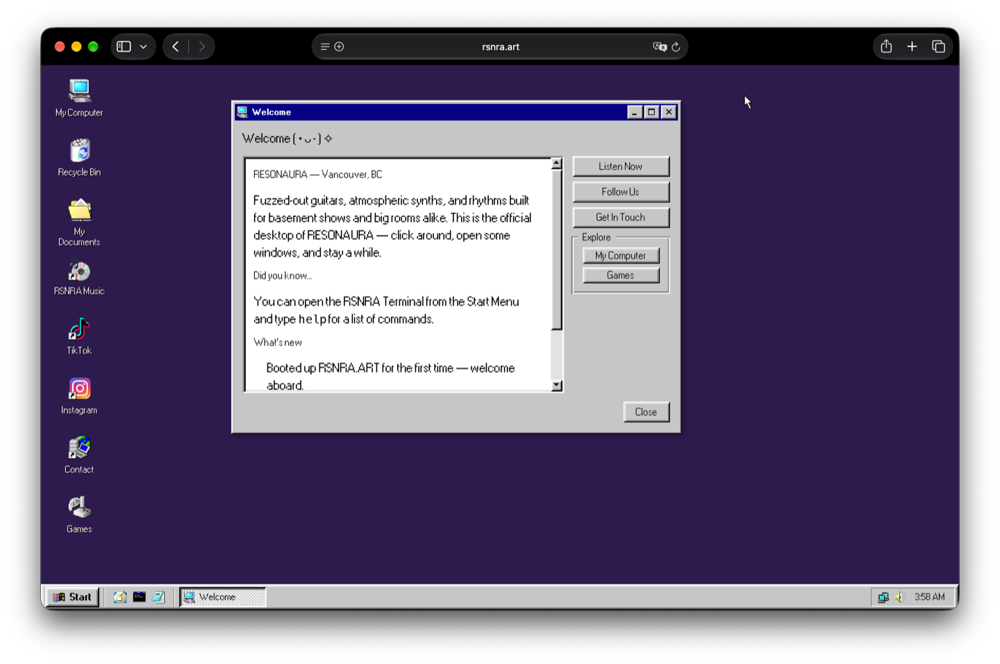

# RSNRA.ART

[](package.json)
[](package.json)
[](package.json)
[](package.json)
[](https://react95.io)
[](https://rsnra.art)
[](https://buymeacoffee.com/resonaura)

The official desktop of **RESONAURA** — an alternative rock band from Vancouver, BC — rebuilt as a fully-clickable, draggable, minimizable homage to Windows 95.


<p align="center">
  
</p>

---

Built with Vite, React, TypeScript, [react95](https://react95.io), and
zustand. Window icons curated from
[trapd00r/win95-winxp_icons](https://github.com/trapd00r/win95-winxp_icons).

## Getting started

```sh
pnpm install
pnpm dev
```

## Editing content

All band-specific copy and links live in one place:
[`src/data/content.ts`](src/data/content.ts) — band name, location,
bio text, the `rsnra.link/resonaura` music link, TikTok/Instagram
handles, and the booking email. Edit that file; nothing else hardcodes
this copy.

Wallpaper presets live in
[`src/store/desktopStore.ts`](src/store/desktopStore.ts).

## Structure

- `src/store` — zustand stores for window/process management and
  desktop preferences.
- `src/components` — Desktop, Taskbar, Start Menu, Window chrome,
  Close Program (Ctrl+Alt+Delete) dialog, Run dialog, boot/shutdown
  screens.
- `src/apps` — each "app" (Welcome, My Computer, Notepad, Music,
  Social, Contact, Terminal, Minesweeper, Snake, Games folder,
  Recycle Bin, Help, Control Panel).
- `src/data/apps.tsx` — the app registry; `openApp(id)` opens any app
  from anywhere (Start Menu, desktop icons, Terminal `open` command,
  Run dialog).

## Notes

- The Contact app sends via `mailto:` — there's no backend, so it
  opens the visitor's email client pre-filled. Swap in a real form
  handler if you want it to submit silently instead.
- Try the RSNRA Terminal (Start Menu → Programs → Accessories) and
  type `help`. Also try Ctrl+Alt+Delete.
